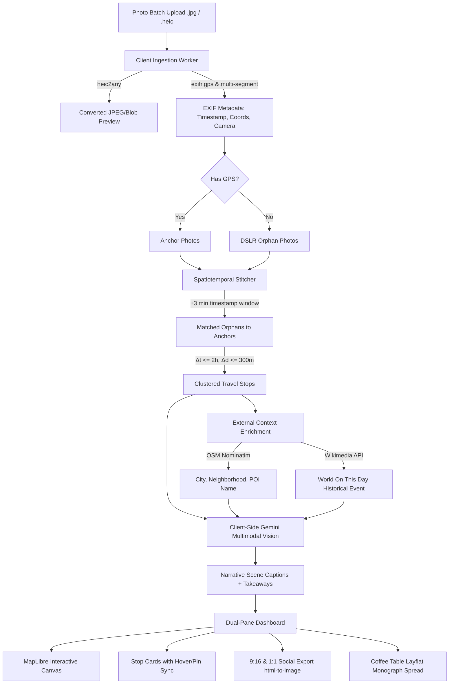

# EpiLog (ἐπί logos)

> *"A picture is worth a thousand words—let them write it for you."*  
> **The AI Travel Journal & Intellectual Keepsake**

[](https://liploan.github.io/EpiLog/)
[](https://nextjs.org/)
[](https://www.typescriptlang.org/)
[](https://tailwindcss.com/)
[](https://maplibre.org/)
[](https://ai.google.dev/)

🌐 **Live Application**: [https://liploan.github.io/EpiLog/](https://liploan.github.io/EpiLog/)

---

## Overview

**EpiLog** is an intelligent travel journal platform that transforms raw vacation photo dumps into interactive maps, narrative timelines, contextual daily news capsules, and reflective *"What I Learned"* takeaways—with zero manual journaling required during your trip.

Derived from the classical Greek *epílogos* (ἐπί logos = a speech or conclusion added after a journey), EpiLog bridges professional DSLR/mirrorless photography with smartphone sensor telemetry to preserve the cultural, architectural, and culinary meaning of your travels.

---

## Key Features

- **Intelligent Sensor Fusion (DSLR + Phone Bridging)**:
  - **Temporal Alignment**: Indexes all photos chronologically via universal EXIF timestamps (`DateTimeOriginal`).
  - **Proximity GPS Tagging ($\pm 3\text{ min}$)**: Automatically matches GPS-less DSLR orphan photos to phone GPS anchors taken within temporal proximity.
  - **Hero Curation**: Automatically selects high-resolution camera frames as hero imagery with inherited coordinates.
- **Spatiotemporal Clustering**:
  - Groups photos into distinct stops using a threshold of $2\text{ hours}$ and $300\text{ meters}$ radius from the geographic centroid.
- **External Context & Historical News Capsule**:
  - **OpenStreetMap Nominatim**: Reverse geocodes coordinates to human-readable POI, neighborhood, and city names.
  - **Wikimedia REST API**: Pulls *"On this day in the world..."* historical events matching the calendar day of each travel stop.
- **Multimodal Scene Intelligence**:
  - Powered by **Gemini 1.5 Flash Vision** (client-side in the browser) to produce 1-2 sentence editorial scene captions and categorized reflections (*Architectural*, *Culinary*, *Natural*, *Cultural*).
- **Social Event Studio (9:16 Vertical & 1:1 Square)**:
  - 1-click generation of DOM-based vertical cards (Instagram Stories / Pinterest) and square posts across 4 curated editorial themes (*Editorial Dark*, *Magazine Light*, *Terracotta Sunset*, *Vintage Passport*).
- **Fine-Art Coffee Table Book Monograph**:
  - Interactive two-page layflat book spread preview with archival 200+ GSM typography, optical sensor metadata, and high-res print export.
- **Executive Pitch Deck**:
  - Ready-to-present 8-slide presentation generated via `python-pptx` (`EpiLog_Pitch_Deck.pptx`).

---

## Apple Photos Ingestion Guide

To ensure full EXIF GPS coordinates and camera timestamps are preserved when importing your own trip photos from macOS Apple Photos:

1. Open **Photos.app** and select your trip album (e.g. *Trip To Spain*).
2. Press **`Cmd + A`** to select all photos.
3. In the menu bar, click: **`File` ➔ `Export` ➔ `Export Unmodified Original For [N] Photos...`**
4. Save them to a folder on your Desktop.
5. Open [EpiLog](https://liploan.github.io/EpiLog/), click **"Upload Photos"**, and drag the folder directly into the dropzone.

---

## Architecture & Pipeline



---

## Tech Stack

- **Frontend**: Next.js 14 (App Router, Static Export), React 18, TypeScript, Tailwind CSS, Lucide React
- **Cartography**: MapLibre GL (Hardware-accelerated WebGL vector/raster maps)
- **Metadata Extraction**: `exifr` (GPS IFD, XMP, TIFF headers) + `heic2any` (Apple iPhone image conversion)
- **AI Intelligence**: Google Generative AI (`@google/generative-ai` / Gemini 1.5 Flash client engine)
- **Export Engine**: `html-to-image` for high-DPI client-side card rendering
- **CI/CD Deployment**: GitHub Actions ➔ GitHub Pages

---

## Local Development

```bash
# Clone the repository
git clone https://github.com/liploan/EpiLog.git
cd EpiLog

# Install dependencies
npm install

# Start development server with Turbopack
npm run dev
# or run the one-click launcher
./boot.sh
```

Open [http://localhost:3000](http://localhost:3000) to view the interactive dashboard.

### Run Algorithm Test Suite

```bash
npm run test
```

### Generate Pitch Deck

```bash
npm run deck
```

---

&copy; EpiLog. All rights reserved.
