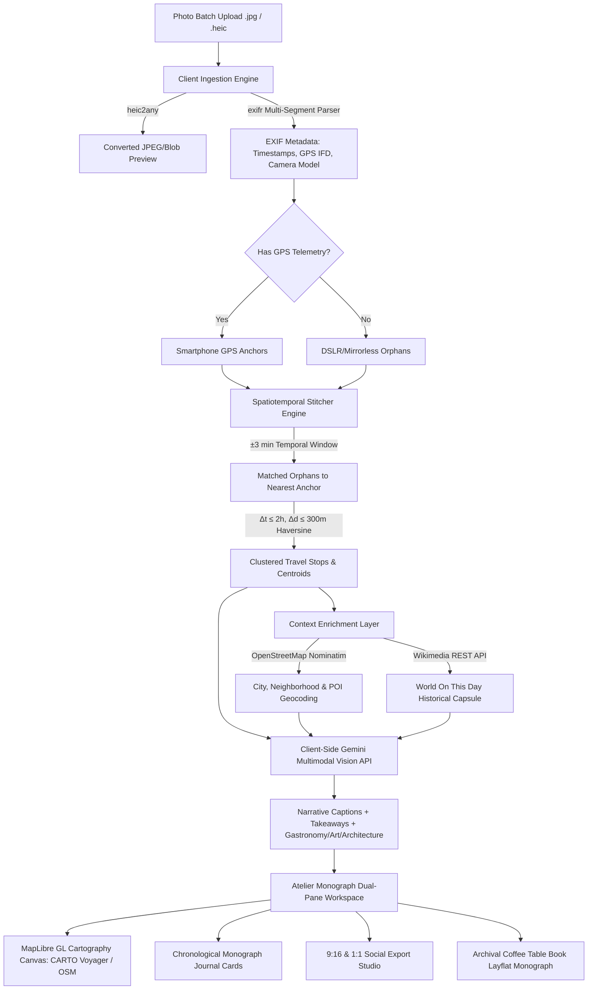

# EpiLog (ἐπί logos)

> *"A picture is worth a thousand words—let them write it for you."*  
> **The AI Travel Journal, Intellectual Keepsake & Fine-Art Monograph**

[](https://liploan.github.io/EpiLog/)
[](https://nextjs.org/)
[](https://www.typescriptlang.org/)
[](https://tailwindcss.com/)
[](https://maplibre.org/)
[](https://ai.google.dev/)
[](https://github.com/liploan/EpiLog)

🌐 **Live Application**: [https://liploan.github.io/EpiLog/](https://liploan.github.io/EpiLog/)

---

## 📖 Philosophy & Overview

**EpiLog** is an intelligent travel journal platform designed to transform raw vacation photo archives into interactive cartographic journeys, literary narrative timelines, contextual daily news capsules, and reflective *"What I Learned"* takeaways—with **zero manual journaling required during your trip**.

Derived from the classical Greek *epílogos* (ἐπί logos = a concluding reflection or meaning added after an odyssey), EpiLog bridges high-end mirrorless/DSLR photography with smartphone sensor telemetry to permanently preserve the intellectual, cultural, architectural, and culinary significance of your travels.

Featuring the **Atelier Monograph** design system—a quiet luxury aesthetic inspired by fine-art editorial publications (*Kinfolk*, *Cereal*, *Monocle*, and archival art monographs)—EpiLog pairs warm linen textures and literary serif typography with high-precision sub-meter geospatial intelligence.

---

## ✨ Core Pillars & Features

### 1. 🏛️ Atelier Monograph Clean Split Layout
* **Dual-Pane Editorial Spread**: A 45/55 clean split layout pairing a chronological literary folio with an edge-to-edge interactive cartography canvas.
* **Warm Archival Palette**: Built on warm linen and bone paper (`#FAF7F2` / `#F3ECE1`), deep espresso ink (`#1C1917`), and refined terracotta/ochre accents (`#B85429` / `#B87C2B`).
* **Literary Typography**: Typeset with *Fraunces* and *Newsreader* serif headline fonts paired with *Plus Jakarta Sans* body text for effortless readability.

### 2. 🛰️ Spatiotemporal Sensor Fusion (DSLR + Phone Bridging)
* **Temporal Indexing**: Automatically synchronizes all photo assets chronologically using EXIF `DateTimeOriginal` and subsecond shutter timestamps.
* **Proximity GPS Bridging (±3 min)**: Automatically matches GPS-less DSLR/mirrorless "orphan" photos to smartphone GPS "anchor" photos taken within temporal proximity.
* **Hero Curation**: Selects prime high-resolution camera frames as hero imagery for each travel stop while inheriting accurate geographic coordinates.

### 3. 🎯 Sub-Meter Corridor Resolution & Micro-Establishments
* **1–3 Meter Precision Ribbon**: Snaps stop locations to micro-establishments (tapas bars, artisan workshops, tea houses) within dense pedestrian corridors.
* **Venue Candidate Snapping**: Interactive corridor POI chips allow 1-click snapping to nearby candidate venues with sub-meter accuracy.

### 4. 🧠 Multimodal Scene Intelligence (Gemini Vision)
* **Literary Narrative Pull-Quotes**: Generates 1–2 sentence editorial scene captions tailored to the mood, time of day, and cultural context.
* **Gastronomy & Dish Identification**: Identifies culinary dishes, culinary origins, key ingredients, and tasting notes from food photography.
* **Fine Art & Museum Cataloging**: Identifies artwork titles, artists/creators, creation eras, and historical significance from museum visits.
* **Structural Architecture & Heritage**: Analyzes architectural styles, historical periods, and master architects.
* **Intellectual Reflections**: Extracts *"What I Learned"* reflections categorized into *Architectural*, *Culinary*, *Natural*, or *Cultural* insights.

### 5. 📚 Fine-Art Coffee Table Book Layflat Monograph
* **Interactive 2-Page Layflat Spread**: Full preview of an archival 200+ GSM layflat monograph book spread with optical sensor stamps, GPS coordinates, and typeset literature.
* **High-Res Export**: 1-click high-DPI PNG export (`html-to-image`) formatted for physical photo book printing.

### 6. 📱 Social Event Studio (9:16 Vertical & 1:1 Square)
* **Stories & Posts**: 1-click export of DOM-rendered vertical cards (Instagram Stories / TikTok) and square social posts across 4 curated editorial themes:
  - *Editorial Dark*
  - *Magazine Light*
  - *Terracotta Sunset*
  - *Vintage Passport*

### 7. 🌍 Historical "World On This Day" News Capsules
* **Wikimedia API Integration**: Automatically queries and embeds notable world historical events matching the calendar day of each travel stop to contextualize your journey within world history.

### 8. 🔒 Privacy-First Client-Side Architecture
* **Zero Server Storage**: Runs entirely in the client browser. Photos and EXIF data never leave your device.
* **Static Deployment**: Fully compatible with static hosting (GitHub Pages). Supports user-provided Gemini API keys stored locally in `localStorage`.

---

## 🗺️ System Architecture & Ingestion Pipeline


```mermaid
flowchart TD
    A[Photo Batch Upload .jpg / .heic] --> B[Client Ingestion Engine]
    B -->|heic2any| C[Converted JPEG/Blob Preview]
    B -->|exifr Multi-Segment Parser| D[EXIF Metadata: Timestamps, GPS IFD, Camera Model]
    
    D --> E{Has GPS Telemetry?}
    E -->|Yes| F[Smartphone GPS Anchors]
    E -->|No| G[DSLR/Mirrorless Orphans]
    
    F & G --> H[Spatiotemporal Stitcher Engine]
    H -->|±3 min Temporal Window| I[Matched Orphans to Nearest Anchor]
    I -->|Δt ≤ 2h, Δd ≤ 300m Haversine| J[Clustered Travel Stops & Centroids]
    
    J --> K[Context Enrichment Layer]
    K -->|OpenStreetMap Nominatim| L[City, Neighborhood & POI Geocoding]
    K -->|Wikimedia REST API| M[World On This Day Historical Capsule]
    
    J & L & M --> N[Client-Side Gemini Multimodal Vision API]
    N --> O[Narrative Captions + Takeaways + Gastronomy/Art/Architecture]
    
    O --> P[Atelier Monograph Dual-Pane Workspace]
    P --> Q[MapLibre GL Cartography Canvas: CARTO Voyager / OSM]
    P --> R[Chronological Monograph Journal Cards]
    P --> S[9:16 & 1:1 Social Export Studio]
    P --> T[Archival Coffee Table Book Layflat Monograph]
```

---

## 📸 Apple Photos & RAW Import Guide

To preserve original EXIF timestamps and embedded GPS telemetry when exporting your trip from macOS:

1. Open **Photos.app** on macOS and select your trip album.
2. Press **`Cmd + A`** to select all photos.
3. In the menu bar, navigate to: **`File` ➔ `Export` ➔ `Export Unmodified Original For [N] Photos...`**
4. Save the unmodified photos to a folder on your Mac.
5. In EpiLog, click **"Upload Photos"** and drop the entire folder directly into the ingestion zone.

---

## 🧮 Spatiotemporal Clustering Algorithm

EpiLog groups discrete photos into meaningful travel stops using spatiotemporal clustering:

#### 1. Centroid Computation

$$
\text{Lat}_{\text{center}} = \frac{1}{N}\sum_{i=1}^N \text{Lat}_i, \qquad \text{Lng}_{\text{center}} = \frac{1}{N}\sum_{i=1}^N \text{Lng}_i
$$

#### 2. Haversine Great-Circle Distance

$$
d = 2R \arcsin \left( \sqrt{\sin^2\left(\frac{\Delta\phi}{2}\right) + \cos(\phi_1)\cos(\phi_2)\sin^2\left(\frac{\Delta\lambda}{2}\right)} \right)
$$

Where:
* $\phi_1, \phi_2$ are latitudes in radians
* $\Delta\lambda$ is the longitude difference in radians
* $R = 6371\text{ km}$ (mean Earth radius)

#### 3. Spatial & Temporal Clustering Thresholds

* **Temporal Gap**: $\Delta t \le 2\text{ hours}$ between consecutive exposures
* **Spatial Radius**: $\Delta d \le 300\text{ meters}$ radius from stop centroid
* **DSLR Matching Window**: $\Delta t_{\text{orphan}} \le 180\text{ seconds}$ for phone-to-DSLR coordinate inheritance

---

## 🛠️ Technology Stack

| Domain | Technology | Purpose |
| :--- | :--- | :--- |
| **Framework** | [Next.js 14](https://nextjs.org/) (App Router, Static Export) | Single-page application & static asset generation |
| **Language** | [TypeScript 5.6](https://www.typescriptlang.org/) | Strict type safety across travel models |
| **Styling** | [Tailwind CSS 3.4](https://tailwindcss.com/) | Atelier Monograph design tokens & responsive layout |
| **Cartography** | [MapLibre GL 4.7](https://maplibre.org/) | WebGL hardware-accelerated vector & raster rendering |
| **Basemaps** | Atelier Pastel (HOT), OSM Standard, OpenTopoMap | 100% open, API-key-free cartographic basemaps |
| **Metadata** | `exifr` & `heic2any` | Client-side EXIF/XMP parsing and Apple HEIC conversion |
| **AI Vision** | Google Generative AI (`@google/generative-ai`) | Multimodal Gemini Vision for scene synthesis |
| **Export Engine** | `html-to-image` | High-DPI canvas & book monograph PNG generation |
| **Icons** | `lucide-react` | Understated iconography |

---

## 🚀 Getting Started

### Prerequisites

* [Node.js](https://nodejs.org/) v18.17+ or v20+
* `npm` or `pnpm`

### Installation & Setup

```bash
# 1. Clone the repository
git clone https://github.com/liploan/EpiLog.git
cd EpiLog

# 2. Install dependencies
npm install

# 3. Start development server with Turbopack
npm run dev

# Alternatively, launch with the one-click boot script:
./boot.sh
```

Open [http://localhost:3000](http://localhost:3000) in your browser.

### Run Verification Test Suite

Verify spatiotemporal clustering, Haversine calculations, and orphan-anchor matching:

```bash
npm run test
```

### Production Build

```bash
npm run build
```

---

## 📄 License & Attribution

* Cartography data &copy; [OpenStreetMap](https://www.openstreetmap.org/copyright) contributors, &copy; [CARTO](https://carto.com/attributions).
* Historical event capsules powered by [Wikimedia Foundation](https://www.wikimedia.org/).
* Reverse geocoding via [OpenStreetMap Nominatim](https://nominatim.openstreetmap.org/).

&copy; EpiLog. All rights reserved.

